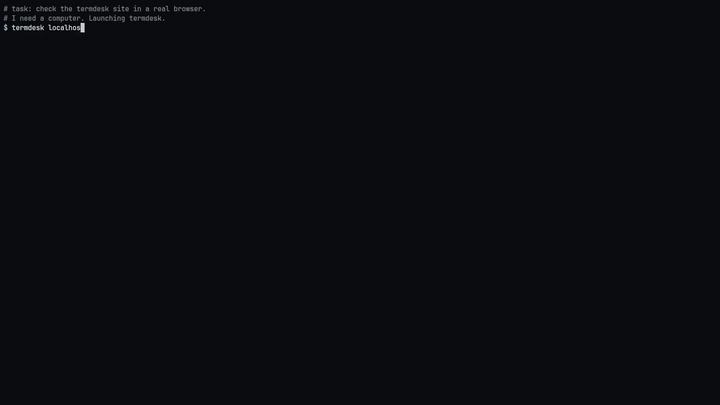

# termdesk

A computer inside your terminal.



The clip runs at 1.75x speed. Watch the [full, unedited run](https://termdesk.warpfield.me/agent-demo.mp4) on the site.

[Website](https://termdesk.warpfield.me) · Part of [Warpfield](https://warpfield.me)

## What it does

termdesk draws a real desktop inside your terminal pane. You use it with your own mouse and keyboard. A coding agent can use it too, from any shell or any MCP client, and you watch every click it makes.

It talks to the desktop over VNC, a standard protocol for viewing and controlling a remote screen. Point it at any VNC server, or start a throwaway Linux desktop in Docker with one command. In that throwaway desktop, your agent reads the screen as a numbered list of buttons, fields and table cells, clicks by number, and gets told whether what it typed landed.

## Install

```bash
curl -fsSL https://termdesk.warpfield.me/install | bash
```

The script installs [uv](https://docs.astral.sh/uv/) if you do not have it, then installs termdesk from the wheel on the site. If `~/.claude` exists, it also adds the Claude Code skill. Run it again to upgrade.

To remove termdesk and everything it created (sessions, sandboxes, the desktop image, the skill, and uv if the installer added it):

```bash
termdesk uninstall
```

You need:

- macOS or Linux.
- A terminal that speaks the kitty graphics protocol: kitty, Ghostty or WezTerm.
- Python 3.9 or newer.
- Docker, for sandboxes. Plain `termdesk host:port` works without it.

The install takes about 35 MB, most of it numpy and Pillow.

## Quick start

Start a sandbox and look at it:

```bash
termdesk sandbox up --name work     # XFCE, Firefox and LibreOffice in Docker; the first run downloads the image
termdesk window work                # a new kitty, Ghostty or WezTerm window shows the desktop
```

Or run `termdesk work` to show it in the pane you are already in.

Ctrl+Q closes the window. Every other key and mouse event goes to the desktop.

Drive the same screen from any shell:

```bash
termdesk action state                              # the screen as numbered elements
# [3] push button "Web Browser" @640,752 48x48
termdesk action click 3                            # Firefox opens
termdesk action wait-for "enter address"           # wait until the address bar shows up
# [11] entry "Search or enter address" @272,78 788x28 [focused, editable]
termdesk action set-value 11 https://example.org   # click element 11, select all, type
# chars=19  via=keys  focused={"role": "entry", "name": "Search or enter address", "app": "Firefox"}  verified=True
termdesk action key Return
termdesk action wait-idle                          # wait until the screen stops changing
termdesk action state                              # what changed since the last state
termdesk action click 640 400                      # or click by desktop pixel
termdesk action done                               # clear the AGENT ACTING badge
```

Element numbers come from your own `state` output. On a fresh sandbox they match the ones above.

Clean up when you finish:

```bash
termdesk sandbox down work          # or: termdesk sandbox down --all
```

To view a machine you already have, pass its address. The port defaults to 5900:

```bash
termdesk myhost:5901
```

termdesk does not support VNC passwords yet. Run the server without one and reach it through an ssh tunnel:

```bash
ssh -L 5900:localhost:5900 user@box   # in one pane
termdesk localhost                     # in another
```

## For agents

Every session opens a control socket. `termdesk action` sends commands to it, so any agent that can run shell commands can use the desktop. While the agent acts, the pane shows an AGENT ACTING badge, and you can take the mouse back at any time.

So you can watch, an agent should open the session in its own terminal window first:

```bash
termdesk window work        # new kitty, Ghostty or WezTerm window showing the sandbox
```

```text
state [--full] [--window T] [--focused]   numbered elements (diff by default) and the focused one
screenshot [PATH] [--scale S]             save a PNG
click INDEX | click X Y                   [--right | --middle] [--double]
set-value INDEX TEXT                      click, select all, type
type TEXT [--paste|--keys] | key COMBO    e.g. key ctrl+l, key Return
open FILE|URL                             open in the default app; host files are copied in
paste TEXT | clipboard                    set or read the desktop's clipboard
scroll INDEX DY | scroll X Y DY [DX]
drag X1 Y1 X2 Y2
wait MS | wait-idle [--idle MS] [--timeout MS]
wait-for TEXT [--timeout MS]              an element or window title containing TEXT
record start [PATH] [--fps N] | record stop
info | done | quit
```

The accessibility tree is the list of on-screen elements that apps publish for screen readers. Each element comes back with an index, role, name, value and pixel box. Big tables, spreadsheets and file lists show only the cells on screen, so `state` stays fast. The tree works inside a termdesk sandbox. On other VNC hosts, use `screenshot` and pixel coordinates.

In a sandbox, `type` and `set-value` report the element that had focus and whether the text arrived (`verified=True`), and warn when focus is on a button or menu that would swallow letters. Text a US keyboard cannot type, such as accents, CJK or emoji, goes through the clipboard, so it arrives intact.

Add `--name SESSION` when more than one session runs (`termdesk ls` lists them), and `--json` for machine-readable output. For a session with no window, on a server or in CI, run:

```bash
termdesk work --headless --daemon
```

### Claude Code skill

```bash
termdesk setup
```

This copies the skill to `~/.claude/skills/termdesk/SKILL.md`. The skill gives the agent the full command reference, an observe, act, verify loop, and a confirmation policy for risky steps such as payments or passwords. The source lives in [termdesk/skill/SKILL.md](termdesk/skill/SKILL.md). The repo also ships a Claude Code plugin manifest in [.claude-plugin/plugin.json](.claude-plugin/plugin.json).

### Other agents

Any MCP client (Codex, Cursor, Gemini CLI, Claude Desktop, your own loop) can use termdesk as an MCP server:

```json
{"mcpServers": {"termdesk": {"command": "termdesk", "args": ["mcp"]}}}
```

The server offers the actions above as tools, plus `sandbox_up`, `window`, `sandbox_cp` and `sandbox_exec`. Screenshots come back as images.

Agents that only run shell commands can read the same guide the skill carries:

```bash
termdesk guide >> AGENTS.md
```

### Sandboxes

```bash
termdesk sandbox up --name work --geometry 1280x800 --memory 2g --cpus 2
termdesk sandbox up --name work --session         # also start a background session for `termdesk action`
termdesk sandbox up --name work --share ~/data    # ~/data at /home/guest/shared, read-only (~/data:rw to write)
termdesk sandbox cp report.xlsx work:             # copy in, to /home/guest, owned by the desktop user
termdesk sandbox cp work:out.csv .                # copy out
termdesk sandbox exec work -- firefox https://example.com   # launch an app
termdesk sandbox exec --root work -- sh -c 'apt-get update && apt-get install -y gimp'
termdesk sandbox snapshot work clean              # save it as an image
termdesk sandbox restore clean --name work2       # start a copy
termdesk sandbox ls
```

Each sandbox is one container with a memory and CPU cap. Its VNC port listens on 127.0.0.1 alone, so other machines cannot reach it. The image is set up for agents: Firefox and LibreOffice start without welcome pages, tips or recovery prompts, LibreOffice does not autocomplete or autocorrect typed text, and the text cursor does not blink, so `wait-idle` settles. A script inside the sandbox can read and write the open LibreOffice document through a local pipe; the skill shows how.

`--share` works for folders your Docker VM can see, which for colima and Docker Desktop is your home folder by default. termdesk refuses other folders instead of mounting an empty one.

## How it works

- **Frames.** termdesk reads the screen over VNC and asks for ZRLE, a compressed encoding. It redraws the rectangles that changed with the kitty graphics protocol. A full 1280x800 frame is about 60 KB, and a blinking cursor is about 80 bytes. On the same machine, pixels pass through shared memory.
- **Input.** Keys, modifiers, key repeat, mouse buttons and the wheel go back to the desktop as VNC events.
- **Semantics.** The sandbox image runs XFCE, Firefox, LibreOffice and the AT-SPI accessibility bus. `state` runs a small script inside the container that dumps the tree under a deadline. It reads only the visible cells of big tables, and skips an app that hangs instead of waiting on it. A second script follows the keyboard focus, which is how `type` knows where the text went.
- **Control.** Each session listens on a Unix socket under `~/.local/state/termdesk`. `termdesk action` writes one JSON line and reads one back. Slow requests run off the main loop, so the desktop keeps streaming while `state` works.

The status line under the desktop shows fps, bytes in and out, and the transport in use.

## Repo layout

- `termdesk/`: the Python package. `rfb.py` speaks VNC, `gfx.py` draws with kitty graphics, `term.py` reads terminal input, `session.py` runs the loop and control socket, `cli.py` is the entry point, `mcp.py` is the MCP server, `sandbox.py` wraps Docker, `record.py` writes GIF and MP4, `uninstall.py` removes termdesk and what it created.
- `termdesk/skill/SKILL.md`: the agent skill, also printed by `termdesk guide`. `skill/SKILL.md` is a copy for the plugin.
- `desktop/`: files copied into the sandbox image. `start.sh` boots the desktop, `a11y_dump.py` prints the accessibility tree, `focus_track.py` follows the keyboard focus. `desktop/system/` holds the Firefox and LibreOffice defaults, copied to system paths.
- `Dockerfile`, `docker-compose.yml`: the XFCE, Firefox and LibreOffice desktop image. `tiny.Dockerfile` builds a small xterm desktop for protocol tests.
- `tests/`: unit tests, `python3 -m unittest discover -s tests`.
- `scripts/`: the installer and the script that records the demo video.
- `site/`: the website, installer and wheel, served on Vercel.

## Prior art

[desktui](https://github.com/mishushakov/desktui) drew a VNC desktop with kitty graphics first. [sshdesk](https://github.com/rylena/sshdesk) added an agent CLI over ssh. [terminal-browser](https://terminal-browser.com) did the same for a browser and got this project started.

## License

MIT. See [LICENSE](LICENSE).
